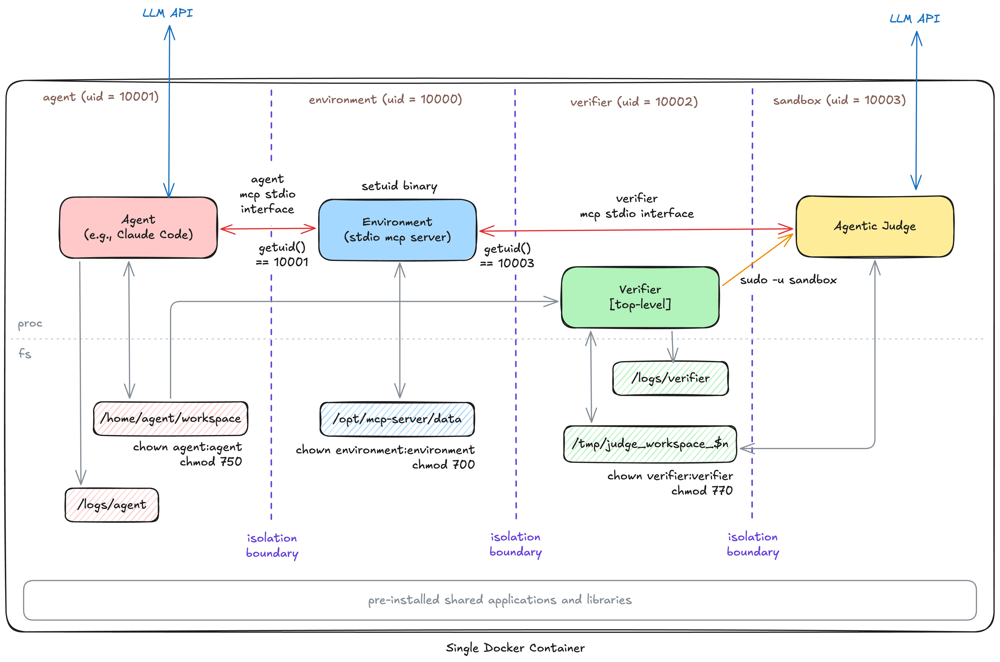

# Reinforcement Learning Environment - Packaging Architecture

This repository demonstrates a packaging architecture for reinforcement learning environments for LLM agents that:

- Supports pluggable agents, installed or external
- Supplies pre-installed applications and libraries for the agent
- Provides the agent with an MCP server that has **private read/write data**, allowing for modeling arbitrary environments with hidden state
- Provides an agent-as-judge verifier that can be used to evaluate the agent's performance
- Runs in a single Docker container

All while maintaining _isolation_ between the agent and environment (MCP server) and supporting _privilege separation_ to allow splitting the verifier into a top-level module that is separated from the agent-as-judge execution.

The setting we consider is one that is different from, for example, [Terminal-Bench](https://www.tbench.ai/). In the setting considered here, we want to model an environment that includes state private to the agent, accessible only through an API. For example, consider packaging tasks for a finance-related benchmark: in such a benchmark, we might want an agent that can act in an environment where it has access to a computer (and tools like file read/write and terminal access), but also has access to external APIs like [FactSet](https://www.factset.com/) and tools like Outlook email, which we'd model as an MCP server with hidden state (e.g., the data files in FactSet, the state of the email inbox, other users' inboxes, etc.). We consider tasks where the results cannot be graded by unit tests, but are instead graded using rubrics, where the verifier is an LLM agent that interacts with the environment in its final state to determine the grade.

The design in this repository is inspired by [OKWS (USENIX ATC '04)](https://www.usenix.org/legacy/publications/library/proceedings/usenix04/tech/general/full_papers/krohn/krohn.pdf), using ingredients like Linux users, processes, filesystem ownership and permissions, setuid binaries, and sudo.

This demo implementation is built to follow the [Harbor](https://harborframework.com/) task format.

## Architecture

### Environment

The environment runs as the `environment` user (UID 10000), and it models the external environment (APIs, external services, data stores, etc., such as FactSet and Outlook email) that the agent interacts with. The environment is implemented as an MCP server that maintains internal state in `/opt/mcp-server/data` that is kept private from the agent.

The environment is run through a setuid binary, `/usr/bin/mcp-server`, that runs an stdio MCP server as the `environment` user, so it can be invoked by any user (e.g., the agent or verifier), but it can access the MCP server's data directory. The MCP server uses [`getuid(2)`](https://man7.org/linux/man-pages/man2/getuid.2.html) to determine the user that launched it and distinguish between agent and verifier users, so it can expose different tools to each.

When invoked by the agent, the MCP server exposes one set of tools (e.g., `factset_search()`, `outlook_create_draft()`, etc.). When it's invoked by the verifier, the MCP server exposes a different set of tools, hiding the tools that mutate state, and exposing additional tools that allow the verifier to query the environment's state to aid the verifier in evaluating the agent's performance (e.g., `outlook_get_inbox(user)`).

### Agent

The agent runs as the `agent` user (UID 10001). It can either be an installed agent (installed into the Docker container itself), or run externally to the container, in which case it executes individual terminal commands in the container as the `agent` user. The architecture diagram above depicts an installed agent.

This agent has access to its workspace, `/home/agent/workspace`, but it does not have any access or visibility into the MCP server's data directory, `/opt/mcp-server/data`, due to the way the filesystem permissions are set up.

The environment contains pre-installed software for the agent, such as Python libraries and binaries, which are installed into the Docker container itself.

### Verifier and Sandbox

The verifier runs as the `verifier` user (UID 10002). It has access to the agent's workspace, `/home/agent/workspace`, and it also has access to query the MCP server to aid in verification.

Because we consider tasks where grading is done according to a rubric, and we rely on an [agent-as-judge](https://arxiv.org/abs/2410.10934) to evaluate individual rubric items, it is handy to be able to sandbox the agent-as-judge execution from the top-level verifier code. For this reason, we have an additional user, the `sandbox` user (UID 10003), used for privilege separation. Using `sudo`, the verifier can invoke commands as the sandbox user to evaluate individual rubric items. The verifier and sandbox user share state through the filesystem.

## Code structure

This repository contains a demo implementation of the architecture described above, for pedagogical purposes, in the form of a single [Harbor task](https://harborframework.com/docs/tasks). The implementation is illustrative; the task, MCP tools, and rubric are not realistic, but contain all the essential characteristics of a realistic task (e.g., state private to the environment, tool that mutates private state, agent that writes to its workspace, rubric items that make use of agent judges, and a simple implementation of an agent-as-judge verifier).

The code is well-commented to explain details of each component.

- [`sample-task/environment/Dockerfile`](sample-task/environment/Dockerfile): Dockerfile that sets up:
    - Pre-installed software and libraries for the agent
    - Process-based isolation and privilege separation
- [`sample-task/environment/data`](sample-task/environment/data): private data (initial state) for the environment
- [`sample-task/environment/mcp-server-run.c`](sample-task/environment/mcp-server-run.c): setuid binary trampoline that runs the MCP server
- [`sample-task/environment/mcp-server`](sample-task/environment/mcp-server): MCP server implementation
- [`sample-task/tests/grader.toml`](sample-task/tests/grader.toml): verifier configuration
- [`sample-task/tests/rubric.json`](sample-task/tests/rubric.json): rubric
- [`sample-task/task.toml`](sample-task/task.toml): task configuration (includes specifying the user the agent and verifier run as)

The verifier itself lives in [Handshake-AI-Research/gandalf-the-grader](https://github.com/Handshake-AI-Research/gandalf-the-grader).

## Running the example

1. Set `ANTHROPIC_API_KEY`
1. `cd sample-task`
1. Run, for example: `harbor run -p . -a claude-code -m claude-sonnet-4-5-20250929`
